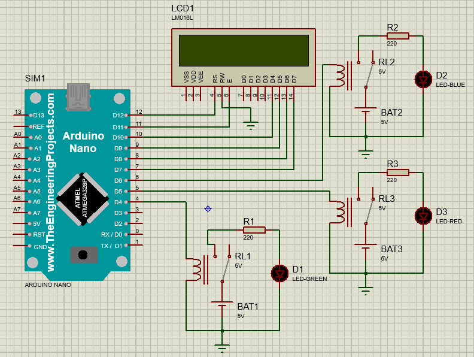
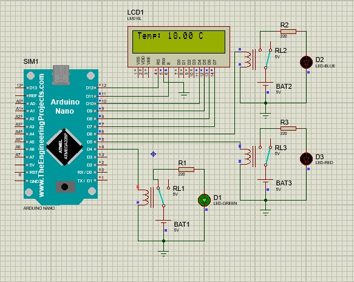
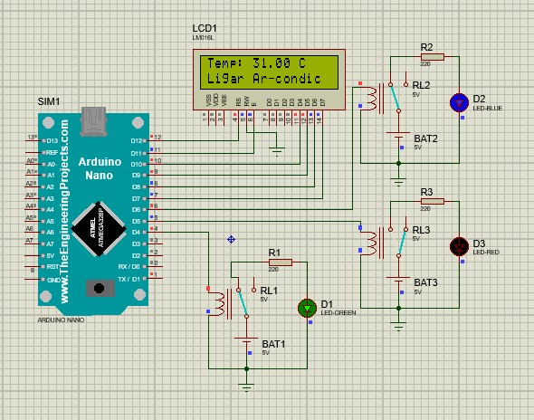
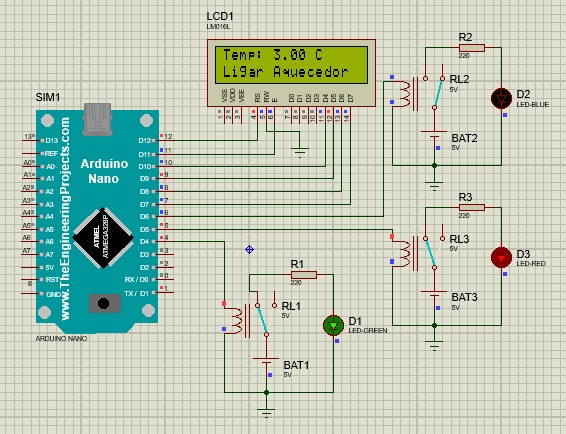

# Introdução ao RTOS
O uso de um RTOS (Real-Time Operating System) é essencial em projetos que exigem a execução de tarefas em tempo real com prazos determinísticos. Um RTOS fornece uma estrutura de software que permite o agendamento de tarefas, gerenciamento de prioridades, sincronização e comunicação entre tarefas, além de garantir uma resposta rápida a eventos críticos. Com sua eficiência e recursos de temporização precisa, um RTOS pode oferecer um ambiente confiável e escalável para o desenvolvimento de sistemas embarcados, permitindo modularidade, facilidade de manutenção e o cumprimento de requisitos de tempo real.


# Multitarefas com FreeRTOS
O FreeRTOS é um sistema operacional de tempo real que suporta a execução de multitarefas em sistemas embarcados. Com o FreeRTOS, é possível criar várias tarefas independentes que são agendadas e executadas de acordo com suas prioridades. O kernel do FreeRTOS permite a comutação rápida e eficiente entre as tarefas, garantindo que cada tarefa tenha sua fatia de tempo para executar. Além disso, o FreeRTOS fornece mecanismos de sincronização e comunicação entre as tarefas, permitindo a troca de dados e a coordenação de atividades. Com o suporte à multitarefa do FreeRTOS, é possível desenvolver sistemas complexos com tarefas concorrentes, oferecendo modularidade, escalabilidade e tempo de resposta determinístico.

# Sincronização de tarefas
Em um ambiente de produção mais complexo, onde as tarefas compartilham recursos críticos, é necessário utilizar mecanismos de sincronização, como semáforos e mutexes. Esses recursos garantem a coordenação adequada entre as tarefas, evitando conflitos de acesso e garantindo a integridade dos dados compartilhados. Esses mecanismos permitem que as tarefas aguardem a disponibilidade de recursos antes de acessá-los e garantem acesso exclusivo a recursos compartilhados. Ao utilizar semáforos e mutexes, é possível evitar problemas como condições de corrida e inconsistências nos dados, assegurando um comportamento correto e previsível do sistema.


# Reações baseadas em condições de tempo real
No código fornecido, a tarefa "TaskReadTemperature" lê a temperatura de um sensor simulado e atualiza a variável volátil "temperature". Dependendo do valor da temperatura, as tarefas "TaskBlink2" e "TaskBlink3" acendem ou apagam LEDs conectados a pinos específicos. Se a temperatura for maior ou igual a 26.00 graus, o LED ligado ao "led_pin_2" é acionado, indicando a necessidade de ligar um ar-condicionado. Se a temperatura for menor ou igual a 10.00 graus, o LED ligado ao "led_pin_3" é acionado, indicando a necessidade de ligar um aquecedor. Essas reações em tempo real permitem um feedback visual com base na temperatura medida pelo sensor.


# Vantagens
O uso de um RTOS (sistema operacional em tempo real) em aplicações IoT traz diversas vantagens. Ele permite a execução simultânea de várias tarefas, garantindo a eficiência e independência de funcionalidades. Além disso, oferece agendamento e priorização de tarefas, gerenciamento de recursos eficiente, facilita o desenvolvimento e proporciona escalabilidade para expansões futuras. Em resumo, um RTOS torna as aplicações IoT mais robustas, responsivas e capazes de lidar com os desafios do ambiente interconectado.


# Código Fonte
```javascript
#include <Arduino.h>
#include <Arduino_FreeRTOS.h>
#include <LiquidCrystal.h>

#define led_pin_1 4
#define led_pin_2 6
#define led_pin_3 5
LiquidCrystal lcd(12, 11, 10, 9, 8, 7);

void TaskBlink1(void *pvParameters);
void TaskBlink2(void *pvParameters);
void TaskBlink3(void *pvParameters);
//  protótipos para as tarefas
void TaskReadTemperature(void *pvParameters);
// Variável para armazenar a temperatura lida
volatile float temperature = 0.0;

void setup()
{
  pinMode(led_pin_1, OUTPUT);
  pinMode(led_pin_2, OUTPUT);
  pinMode(led_pin_3, OUTPUT);
  Serial.begin(9600);
  lcd.begin(16, 2);
  // cria as tarefas
  xTaskCreate(
      TaskReadTemperature,
      "ReadTemperature",
      128,
      NULL,
      3,
      NULL);

  xTaskCreate(
      TaskBlink1, // função da tarefa - ponteiro
      "Blink1",
      128,   // tamanho da pilha
      NULL,  // parametro da tarefa
      2,     // prioridade - numeros mais altos - proporcional ao numero
      NULL); // agendar tarefa

  xTaskCreate(
      TaskBlink2, // função da tarefa - ponteiro
      "Blink2",
      128,   // tamanho da pilha
      NULL,  // parametro da tarefa
      1,     // prioridade - numeros mais altos - proporcional ao numero
      NULL); // agendar tarefa

  xTaskCreate(
      TaskBlink3, // função da tarefa - ponteiro
      "Blink3",
      128,   // tamanho da pilha
      NULL,  // parametro da tarefa
      1,     // prioridade - numeros mais altos - proporcional ao numero
      NULL); // agendar tarefa

  // Crie as outras tarefas aqui
}
void loop()
{
  // nada aqui!
}
void TaskReadTemperature(void *pvParameters)
{
  (void)pvParameters;
  float sensorValue = 0.0;
  for (;;)
  {
    lcd.setCursor(0, 0);
    lcd.print("                ");
    // Aqui você normalmente leria o valor do sensor de temperatura.
    // Por simplicidade, vamos apenas simular um sensor variando a temperatura de - 10 a 40.
    sensorValue = -10.0 + (rand() % 51);
    // gera um número aleatório entre -10 e 40
    temperature = sensorValue;
    lcd.setCursor(0, 0);
    lcd.print("Temp: ");
    lcd.print(temperature);
    lcd.print(" C");
    if (temperature >= 26)
    {
      lcd.setCursor(0, 1);
      lcd.print("Ligar Ar-condic");
    }
    else if (temperature <= 10)
    {
      lcd.setCursor(0, 1);
      lcd.print("Ligar Aquecedor");
    }
    else
    {
      lcd.setCursor(0, 1);
      lcd.print("                ");
    }
    vTaskDelay(2000 / portTICK_PERIOD_MS); // aguarda por 2 segundos
    // vTaskDelay(1000 / portTICK_PERIOD_MS);
  }
}
void TaskBlink1(void *pvParameters)
{
  (void)pvParameters;
  for (;;)
  { // loop infinito
    digitalWrite(led_pin_1, HIGH);
    vTaskDelay(1000 / portTICK_PERIOD_MS); // função millis do RTOS
    digitalWrite(led_pin_1, LOW);
    vTaskDelay(1000 / portTICK_PERIOD_MS);
  }
}

void TaskBlink2(void *pvParameters)
{
  (void)pvParameters;
  for (;;)
  { // loop infinito
    if (temperature >= 26)
    {
      digitalWrite(led_pin_2, HIGH);
    }
    else
    {
      digitalWrite(led_pin_2, LOW);
    }
    vTaskDelay(100 / portTICK_PERIOD_MS);
  }
}

void TaskBlink3(void *pvParameters)
{
  (void)pvParameters;
  for (;;)
  { // loop infinito
    if (temperature <= 10)
    {
      digitalWrite(led_pin_3, HIGH);
    }
    else
    {
      digitalWrite(led_pin_3, LOW);
    }
    vTaskDelay(100 / portTICK_PERIOD_MS);
  }
}
```

# Esquemático montado no Proteus
<div align=center>

</div>

# Em funcionamento
<div align=center>

</div>

<div align=center>

</div>

<div align=center>

</div>